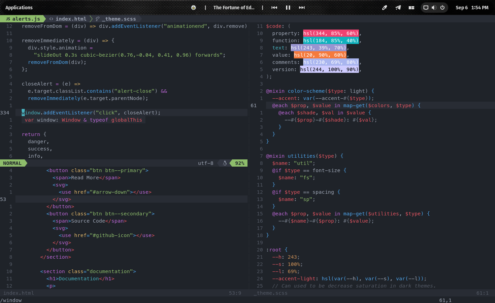

# dotfiles

- Configuration files for Neovim and Fish shell
- Boilerplate for Web Development
- Script for creating the boilerplate

[Guide for Git Bare Repo](https://www.atlassian.com/git/tutorials/dotfiles) for setting up your own dotfiles manager.

## Neovim 



### Folder Structure for Neovim Configuration
```
config/nvim
├── coc-settings.json
├── init.lua
├── lua
│   ├── coc.lua
│   ├── plugins_config.lua
│   ├── plugins.lua
│   ├── remaps.lua
│   ├── settings.lua
│   └── utils.lua
```

## ToDo

- [  ] Create a one line installer script
- [  ] Install a formatter
