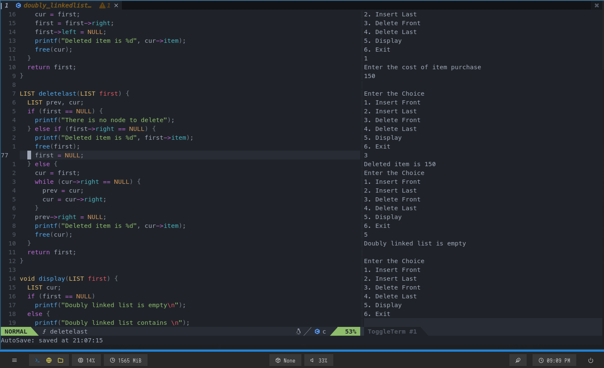

# dotfiles

- Configuration files for Neovim and Fish shell
- Boilerplate for Web Development
- Script for creating the boilerplate

[Guide for Git Bare Repo](https://www.atlassian.com/git/tutorials/dotfiles) for setting up your own dotfiles manager.

## Neovim 

### Web Dev


### C / C++


### Folder Structure for Neovim Configuration
```
config/nvim
├── coc-settings.json
├── init.lua
├── lua
│   ├── disabled.lua
│   ├── plugin_config
│   │   ├── autosave.lua
│   │   ├── blankline.lua
│   │   ├── bufferline.lua
│   │   ├── coc-lua.lua
│   │   ├── formatconfig.lua
│   │   ├── gps.lua
│   │   ├── lualine.lua
│   │   ├── telescope.lua
│   │   ├── toggleterm.lua
│   │   └── treesitter.lua
│   ├── plugins.lua
│   ├── remaps.lua
│   ├── settings.lua
│   └── utils.lua
├── plugin
│   ├── coc.vim
│   └── packer_compiled.lua
└── powerlinesymbols.txt
```

## ToDo

- [  ] Create a one line installer script
- [ x ] Install a formatter (Installed format.nvim)
- [  ] Try configuring LSP with compe (again)
